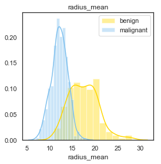

# Breast-Cancer-Study-and-Evaluation
###### Author - Aastha Koshta 

Predicting Breast Cancer Using Various Attributes Captured in Breast Images

# Introduction

Breast cancer develops in the cells of the breasts and is the most commonly diagnosed cancer in women in the United States, following skin cancer. Although it can affect both men and women, it is significantly more prevalent in women.

# Diagnosis
A breast fine needle aspiration (FNA) involves using a fine needle, similar to those used for blood tests, to extract fluid or cells from a breast lesion (such as a cyst, lump, sore, or swelling). A specialist doctor then examines the collected sample.

# About the Data
Features are extracted from a digitized image of a fine needle aspirate (FNA) of a breast mass, detailing the characteristics of the cell nuclei present in the image.

# Features Importance
Under a microscope, normal cells and cancer cells can appear quite different. Unlike normal cells, cancer cells often show significant variability in size, with some being larger and others smaller than normal. Additionally, cancer cells frequently have abnormal shapes, affecting both the cell and its nucleus (the "brain" of the cell). The nucleus of cancer cells typically appears larger and darker than that of normal cells.

# Dataset

The dataset comprises various attributes of the diagnosed cell.

Visualizing the distribution of the output variable within the dataset.

The distribution is in the ratio 60 to 40 for the variable. The accuracy for the M class of output variable might be high as compared to the B class since the number of observations is fewer for B as compared to M.

# The Attributes characteristics for both the classes of output variable for classification 

The texture_mean  attributes have significant overlap as compared to other attributes hence it's not a good variable for classification.

# Correlation Matrix

Some of the attributes have high correlation and hence we will be using PCA to deal with high correlation and reduce dimensionality.

# Using PCA and the components explain the Variance in the dataset.

The first component explains the maximum variability of the dataset as compared to the other components.

# Confusion Matrix

The accuracy of the model is good and the misclassification rate is  fairly low for both the classes of  output variable.

# ROC Curve

As observed from the ROC curve, the false positive rate is nearly zero. This is crucial in the medical field because both false positives and false negatives have significant implications. If the model detects cancer and the patient indeed has breast cancer, the system works as intended. However, if the patient has breast cancer and the model outputs a false negative, the person's life could be at risk.
